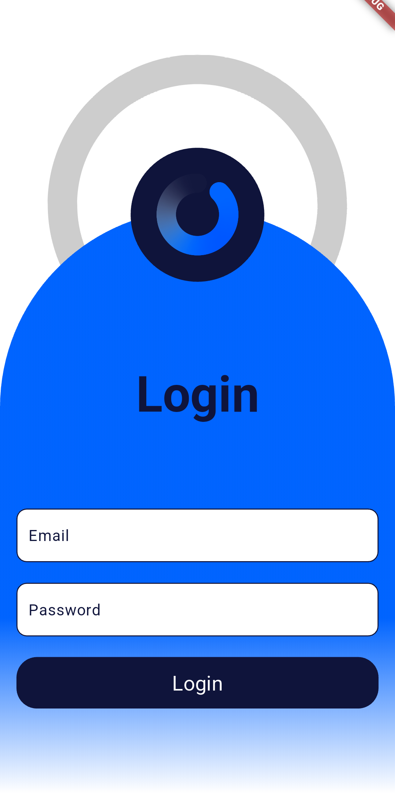
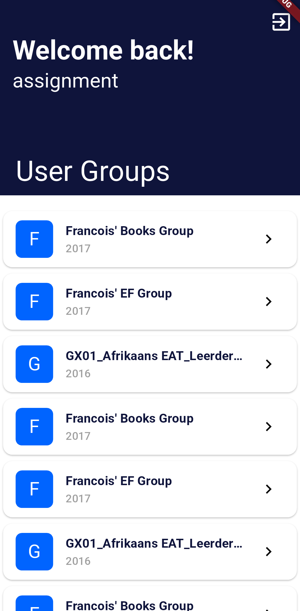
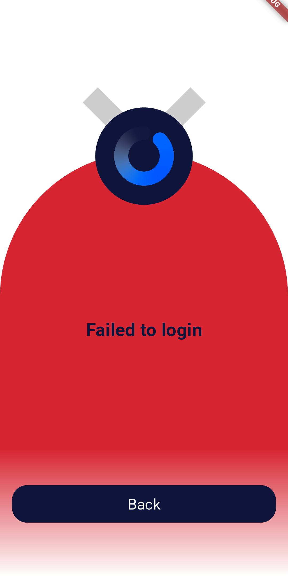

# Flutter Firebase Login App

## Objective

The goal of this project is to build a Flutter application that enables users to log in as specified by the requirements.

## Screenshots

Below are some screenshots of the app:

<p align="center" style="display: flex; flex-wrap: wrap; justify-content: center;">
    
    
    
</p>

## Features

- User authentication via a remote server.
- Simple UI for entering username and password.
- Login functionality using a POST request to the server.
- Secure storage of username and hashed password in a SQLite database.
- Automatic login on app restart using stored credentials.
- Fetch and display user group enrolments via a GET request.
- Clean and concise source code for maintainability.
- Compatibility with provided test credentials for validation.
- Focus on UI/UX and server communication best practices.

### Running the Project
First you have to run the following command. This builds serialation files for the DTO classes.
```
flutter pub run build_runner build
```

## Areas for Improvement

While the project achieves its primary objectives, there are several areas where it could be improved:

### Enhanced UI/UX

I took insperation from the Optimi.co.za website and tried my best to match their style. I don't feel it came out quite right and I'd love to see a detailed style guide when doing something like this again.

### Logging

There is very minimal to almost no logging in this project. This can negatively affect the debuggin experience when building new features in the future.

### Testing

This project does lack unit, widget and integration tests at the moment. Implementing those will round out the project well.

### Side-Hustles

I would like to do this project using a difference design pattern than the BloC aproach used here. There is room for growth in exploring Riverpod, provider and even the BloC package.

By addressing these areas, the project can be made more robust, user-friendly, and maintainable.
